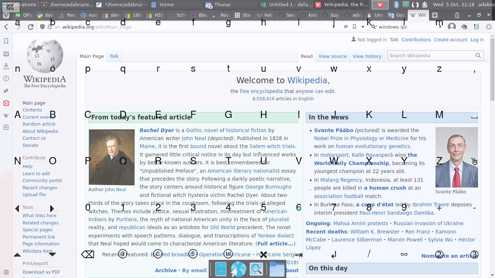

#  Eyeput (WIP)

This is an extended onscreen input method for eye tracking.



```sh
# application dependencies
pip install PySide2 pynput keyboard numpy psutil
# optional development dependencies
pip install pyqtgraph pyopengl

# add to global path for hotkey configuration
sudo ln -s $PWD/eyeput.sh /usr/local/bin/eyeput
# local development
ln -s $PWD/eyeput.sh ~/bin/eyeput

# use your xkb layout as default console keymap
sudo sh -c "echo KEYMAP=de-latin1 > /etc/vconsole.conf"

# to get key codes, run
python -m keyboard /dev/input/event*
# or
dumpkeys --keys-only

# allow access to virtual keyboard
sudo usermod -a -G tty,input $USER
```

Add a hotkey in your window manager with the command: `eyeput toggle`.
